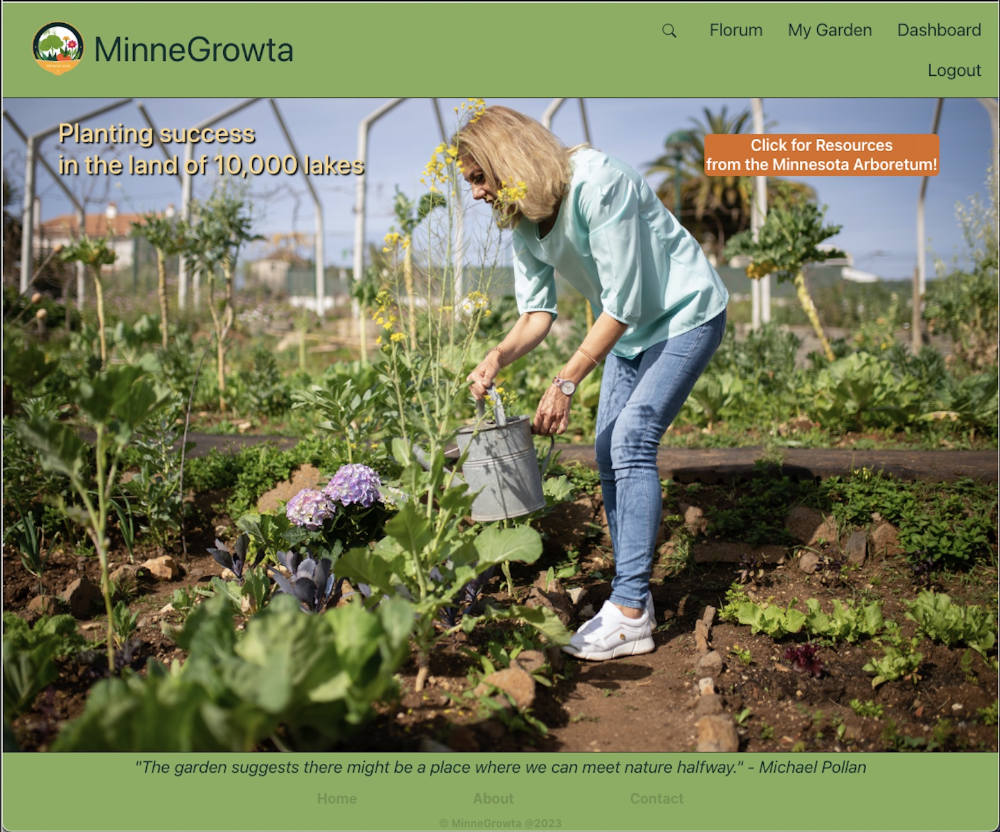

# MinneGrowta

Group Project 3

## Instructions 

- Clone the repo
- Run `npm install` 
- In development mode, launch with `npm run dev`

## The MinneGrowta Garden Planner App

The great state of Minnesota has a very short growing season and is comprised of mostly growing zones 3 and 4.  There are a couple of counties in the southernmost part of the state that are considered zone 5 but for the most part there are a limited number of plants that can thrive outdoors in our land of 10,000 lakes.

This app is for both the novice and the seasoned Minnesota gardener.  All plants listed in the app can be grown in zones 2 - 5 during a typical growth season.  The user may use the app to research plants for their garden, save their favorite plants, keep a record of what has been planted in their garden, and share pictures and questions about their garden with other users.  

There is a timeline feature in which the user can record when a particular seed or plant was sown in order to gauge the approximate maturity and harvest time.

## Acknowledgements

We would like to thank Gary Almes, Austin Slater, and Kathryn Vincent for their help and expertise.

## Authors

- Lauren Bleyl (https://github.com/laurbaur024)
- Sean Chen  (https://github.com/Ad31aid)
- Beth Haynes  (https://github.com/beffylaureen)
- Jacqueline Stiehl  (https://github.com/Jacqueline-Stiehl)
- Damon Tweedy  (https://github.com/dmtweedy)
- Aidan Windebank  (https://github.com/Aidan-Windebank)

## Deployment

## Screenshots

## 

## Resources Used

- Minnesota Landscape Arboretum  https://arb.umn.edu/
- https://www.icangarden.com/zone-3-perennials/
- https://www.lifeinminnesota.com/best-perennials-for-minnesota/
- https://www.gardenloversclub.com/plant-finder/annuals/minnesota-annuals/
- https://commons.wikimedia.org
- https://images.pexels.com
- https://www.publicdomainpictures.net
- https://pixnio.com/free-images
- https://get.pxhere.com
- https://p1.pxfuel.com
- https://s3media.angieslist.com
- https://morningchores.com
- https://d27p2a3djqwgnt.cloudfront.net
- https://cdn.britannica.com
- https://bonnieplants.com
- https://c1.wallpaperflare.com
- https://pixnio.com/free-images
- https://www.bhg.com
- https://seedsheets.com
- https://thebrilliantkitchen.com
- https://www.publicdomainpictures.net
- https://www.hippopx.com
- https://hgshydro.com

